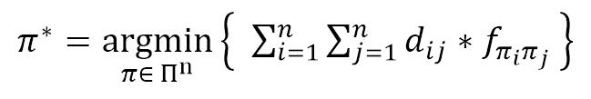

An Enhanced Guided Local Search for the Quadratic Assignment Problem (QAP)
===================

**Abstract**

The Quadratic Assignment Problem (QAP) is one of the most complex NP-Hard combinatorial optimization problems remaining intractable for n>30. However, due to its applicability to many important scientific domains, many meta-heuristic approaches have been successfully implemented. The Guided Local Search (GLS) is one such meta-heuristic that guides a local search over a modified solution landscape induced by an augmented objective function. This paper details a series of enhancements to the basic GLS and is shown to be competitive if not better than GLS.

---

**Introduction**

The Quadratic Assignment Problem (QAP), due to its importance both theoretically and practically stemming from many vital applications to a broad range of fields, has garnered increased research interest in recent years.  It is a problem that entails assigning a set of n facilities to another set of n locations in an optimal manner [1].  Since there exists an inherent distance between each location and a flow demand between each facility, assigning one facility to a particular location impacts the entire system as this facility’s various flows must propagate varying distances to the other facilities that occupy corresponding locations.  To be precise, the goal is to find an optimal permutation that induces an assignment of facilities to locations such that the sum of products between all flows and corresponding distances is minimal.  Koopmans and Beckmann first introduced the problem in 1957 for several economic activities in the formal mathematical definition in what is known as the Koopmans-Beckman QAP [2]. Given two matrices F=[f_ij] and D=[d_ij], find the following permutation. 

      
 
The QAP, since its origins in 1957, has been practically applied in many scientific domains.  These have included “minimizing the number of connections in backboard wiring, economics, assignment of new facilities, scheduling problems, archeology, statistical analysis, analysis of reaction chemistry, numerical analysis, error control in communications, and memory layout optimization in signal processors” [2].  However, it has attracted the most attention in facility-layout problems [2].  These have included “assignment of buildings in a university campus, design of typewriter keyboards and control panels, hospital planning, forest management, facilities layout for minimizing work-in-process, and placement of electronic components” [2].   
       
Many famous combinatorial optimization problems can be seen as special cases of QAP, such as Traveling Salesman, Maximum Clique, Graph Partitioning, and the Band-Width Reduction problems [1].  QAP is considered one of the most demanding combinatorial optimization problem not only because it has been proven NP-hard, but even finding an ?-approximation algorithm remains formidably NP-hard.  Moreover, many exact methods show very poor performance and remain intractable for problem sizes beyond 30. Thus iterative-improvement heuristics to sophisticated meta-heuristics have been applied with drastic results [3].

The Guided Local Search (GLS) is one such iterative improvement meta-heuristic approach successfully applied to QAP.  It has been applied to combinatorial optimization problems including SAT, MAX-SAT, Vehicle Routing, Workforce Scheduling, Radio Link Frequency Assignment, Traveling Salesman, and Function Optimization.  It operates as an algorithmic framework utilizing a problem-specific local-search in navigating a modified solution landscape induced by an augmented objective function.  This augmented objective function is modified each time the local search reaches a local optimum by penalizing select features of the solution.  

This paper proposes the following modifications to GLS:

1. Incorporation of an iteration constrained aspiration criterion designed to further diversify the search similar to the mechanism seen in Taillard’s robust tabu search [4].
2. Evaporation of feature penalties in the augmented objective function to combat too excessive a deformation of the original solution landscape similar to notions borrowed from ant colony optimization [5].
3. Introduction of an intensification policy based on periodic executions of a steepest-descent search on the original objective function [6].  

The contribution to the research community is as follows:
* Robust extensions to the guided local search that may be applied to other combinatorial optimization problems
* Innovative and competitive new approach for the QAP.

The paper is structured as follows. In Section II related works for QAP is elucidated.  In Section III, the guided local search framework is discussed in more detail.  Section IV details the authors’ specific modifications. Section V elaborates on benchmarks, experimentation methodology, results, and analysis.  Section VI ends with concluding remarks and future research potential.  

---

**Files**

- [An Enhanced Guided Local Search for the QAP](Files/An Enhanced Guided Local Search for the QAP.docx)
- [Results](Files/Results)
- [Slides](Files/Final Presentation.pptx)
- [Outline](Files/Outline.docx)
- [Future Work](Files/Future Work.docx)
- [Overview of QAP](Files/Introduction.pptx)
- [Proposal](Files/Proposal.docx)
- [Original GLS Solver (Basic GLS implementation)](Files/OriginalGlsSolver.7z)

---

**Readme**

1. Unzip the QAPSolver folder to any location you desire.
2. Along side the QAPSolver folder, create another folder called "Results".  The results from the application runs will be stored in this directory.
3. Navigate to Setup.cpp, and scroll down to where you see lots of lines commented out.  Here you may choose to specify a filename (that will subsequently be output to the Results folder in csv format) and select any algorithms to run with any set of parameters.  Uncomment and use the existing ones if you should desire.
4. Modify the number of runs via the Runs variable -- this means an algorithm will be averaged this many times, standard deviations calculated, and average run time of all 5 runs.
5. Navigate to the QAPSolver folder and compile like this:

```
g++ *.cpp -O3 -o AppName
nohup AppName &
```

6. Optionally, you may choose to set the Runs=1, and then you can see the progression of quality of solution by a number denoting the relative percentage deviation above the best known result.
7. Important files of interest besides Setup.cpp are:  AlgoParms.cpp - Where all the different parameters for an algorithm run is designed.  Algorithm.cpp - All implementation for the various guided local searches, robust tabu search, etc.
8. If you have any other questions, please don't hesitate to ask.   
       


